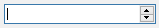

# EDateTimeEdit

扩展了`QDateTimeEdit`控件，主要是为了支持输入空字符串（全选后按下输入或者退格键删除日期文本）。

Header: `#include<EDateTimeEdit>`

Inherits:`QDateTimeEdit`

## 描述

显示空字符时间

扩展了`QDateTimeEdit`控件，主要是为了支持输入空字符串（全选后按下输入或者退格键删除日期文本）。此时通过`date()`等函数返回的日期对象都是不合法的，因此在使用日期之前应当判定该日期是否合法`isValid()`。

当时间由非空设置为空字符串时，不会触发时间更改信号。

## 公有函数

###### EDateTimeEdit(QWidget *parent = nullptr)

###### EDateTimeEdit(const QTime &time, QWidget *parent = nullptr)

######  EDateTimeEdit(const QDate &date, QWidget *parent = nullptr)

######  EDateTimeEdit(const QDateTime &datetime, QWidget *parent = nullptr)

构建一个给定日期时间的编辑控件。

###### void  setEmptyEnabled(bool enable = true)

设置时间控件是否可以设置为空字符串。本控件默认可设置为空字符串。

###### bool emptyEnabled() const

如果控件可设置为空字符串，返回为true，否则返回false。

###### QString text() const

返回当前输入框内显示的时间文本。

###### void clearDisplayText()

清空当前显示的时间文本。调用本函数前，必须先使控件允许输入空字符串`setEmptyEnabled`为`true`，否则清空操作无效。

###### QDate date() const

返回当前输入控件的日期对象。如果输入框为空字符串，则会返回一个不合法的时间对象。

###### QDateTime dateTime() const

返回当前输入控件的日期时间对象。如果输入框为空字符串，则会返回一个不合法的时间对象。

###### QTime time() const

返回当前输入控件的时间对象。如果输入框为空字符串，则会返回一个不合法的时间对象。

