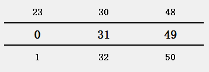

# ETimeWidget

扩展的时间选择控件。

Header:`#include <ETimeWidget>`

## 描述

`ETimeWidget`是一个时间控件，用于选择时间。使用滚轮上下滚动来实现时分秒的选择，事件发生改变时会实时发送`timeChanged()`信号，当点击时间时会发送`clicked()`信号——一般视为时间的选择。

## 信号

###### void timeChanged(const QTime &time)

当时间发生改变时发送本信号。

###### void clicked(const QTime &time)

当单击时间时发送本信号，并同时把当前时间发送出去。

## 公有函数

###### ETimeWidget(const QTime &time,QWidget *parent = nullptr)

构造一个时间显示选择控件。如果传入的`time`不合法，则时分秒按照0:0:0的方式显示。

###### QTime time() const

返回当前选择的时间。

###### void setTime(const QTime &time)

设置当前显示的时间。

## 受保护的函数

###### virtual QLayout* createTimeWidget()

虚函数。用于创建一个合适的时间显示界面布局。